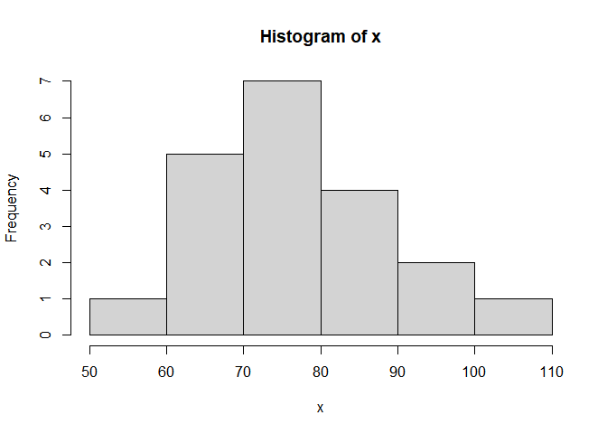
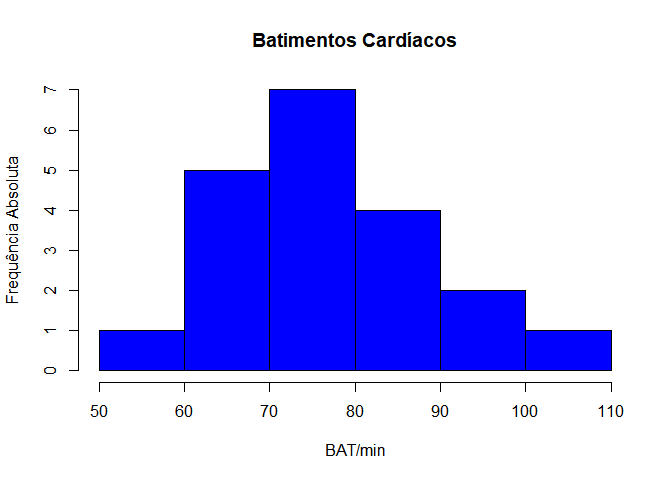
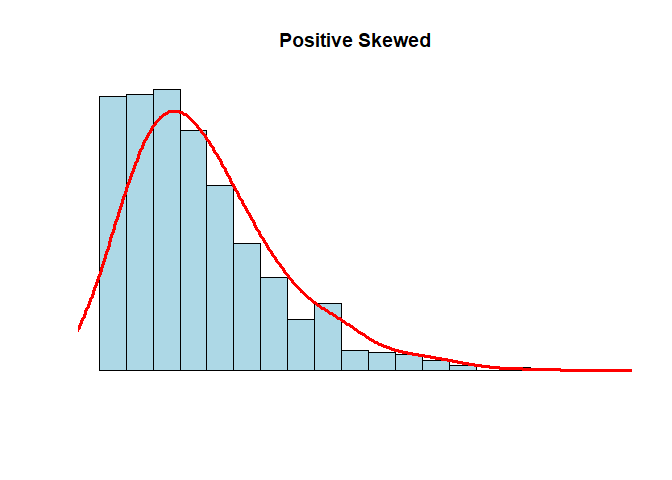
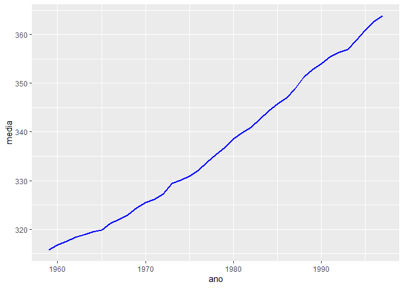
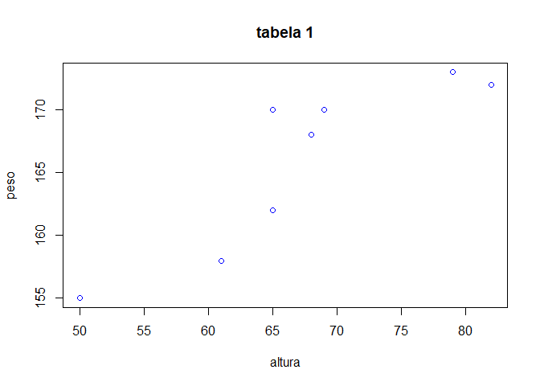

Atividade Avaliativa I
================
Luis Fernando dos Santos de Brito
Estat 2020.1

**Questão 01** A seguir Box Plot ajudas informações sobre a distribuição
de pesos das malas em um avião.

*a)*

Ele não calculou o intervalo for block post, só calculou o intervalo
entre q1 e q2, por isso esta incorreto.

*b)*

15 + 2 = 17

*c)*

23-10 = 13

*d)*

55x24 / 240 = 5,5

**Questão 02** Uma prova foi aplicada em duas turmas distintas. Na
primeira, com 30 alunos, a média aritmética das notas foi 6.40. Na
segunda, com 50 alunos, foi 5.20. A média aritmética das notas dos 80
alunos foi:

6,40x30 + 5,20x50 = 192 + 260/80 = 5,65

*resposta alternativa a)*

**Questão 03 ** Considere os dados abaixo, onde a variável de interesse,
X, é batimentos cardíacos por minuto (BAT / min).

*a)*

``` r
dados  <- c ( 68 , 70 , 72 , 58 , 90 , 110 , 68 , 70 , 72 , 80 ,
             80 , 67 , 90 , 94 , 100 , 80 , 75 , 79 , 84 , 90 )
  ( 110 : 58 )
```

    ##  [1] 110 109 108 107 106 105 104 103 102 101 100  99  98  97  96  95  94  93  92
    ## [20]  91  90  89  88  87  86  85  84  83  82  81  80  79  78  77  76  75  74  73
    ## [39]  72  71  70  69  68  67  66  65  64  63  62  61  60  59  58

*b)*

mídia = 79,85

mediana = 79,5

primeiro quartil = 70

terceiro quartil = 90

desvio padrà £ o = 4,46

*c)*

Não, ambos os valores da mídia e mediana são proximos.

``` r
hist ( dados )
```

<!-- -->

``` r
hist ( dados , ylab  =  " Frequência Absoluta " , xlab  =  " BAT / min " , col  =  " blue " , main  =  " Batimentos Cardíacos " )
```

<!-- -->

**Questão 04** No repositório de dados da disciplina no GitHub,
dados\_csv, analise o conjunto de dados frango\_dieta.csv.

``` r
frango_dieta. <- read_csv("atividade/dados/brutos/frango_dieta.csv")
```

    ## Rows: 578 Columns: 4

    ## -- Column specification --------------------------------------------------------
    ## Delimiter: ","
    ## dbl (4): peso, tempo, frango, dieta

    ## 
    ## i Use `spec()` to retrieve the full column specification for this data.
    ## i Specify the column types or set `show_col_types = FALSE` to quiet this message.

``` r
View(frango_dieta.)
```

*a)*

Não pois ele é apresentado por 579 linhas, e um arquivo tidy e
apresentado por 10.

*b)*

``` r
mean(frango_dieta.$peso)
```

    ## [1] 121.8183

*c)*

``` r
sd(frango_dieta.$peso)
```

    ## [1] 71.07196

*d)*

Tempo, Peso, Frango, Dieta = Quantitativo Discreto

**Questão 05**

eu usaria a média pois, a média se baseia em todos os numeros da curva,
enquanto a mediana se baseia apenas no central e nesse grafico há uma
drastica subida e decida no inicio, então a media é o mais correto a se
considerar.

``` r
# ------------------------------------------------- --------
N <- 1000
x <- rnbinom(N, 4, .5)
hist(
x,
xlim = c(min(x), max(x)),
probability = T,
nclass = max(x) - min(x) + 1,
col = 'lightblue', xlab = ' ', ylab = ' ', axes = F,
main = 'Positive Skewed'
)
lines(density(x, bw = 1), col = 'red', lwd = 3)
```

<!-- -->

``` r
# ------------------------------------------------- --------
```

**Questão 06** Considere o banco de dados dados\_co2.csv

``` r
dados_co2. <- read_csv("atividade/dados/brutos/dados_co2.csv")
```

    ## Rows: 39 Columns: 13

    ## -- Column specification --------------------------------------------------------
    ## Delimiter: ","
    ## dbl (13): ano, jan, fev, mar, abr, mai, jun, jul, ago, set, out, nov, dez

    ## 
    ## i Use `spec()` to retrieve the full column specification for this data.
    ## i Specify the column types or set `show_col_types = FALSE` to quiet this message.

``` r
View(dados_co2.)
```

*a)*

*b)*

Não, pois o tidy apresenta 10 linhas e a tabela em questão 39.

*c)*

``` r
 dados_co2. %>%                
pivot_longer(
1:13,                
names_to = "ano",    
values_to = "dez")
```

    ## # A tibble: 507 x 2
    ##    ano     dez
    ##    <chr> <dbl>
    ##  1 ano   1959 
    ##  2 jan    315.
    ##  3 fev    316.
    ##  4 mar    316.
    ##  5 abr    318.
    ##  6 mai    318.
    ##  7 jun    318 
    ##  8 jul    316.
    ##  9 ago    315.
    ## 10 set    314.
    ## # ... with 497 more rows

*d)*

``` r
dados_co2_tidy <- dados_co2. %>%  
  pivot_longer(
    !ano,
    names_to = "mes",
    values_to = "ppm"
  )

dados_co2_tidy
```

    ## # A tibble: 468 x 3
    ##      ano mes     ppm
    ##    <dbl> <chr> <dbl>
    ##  1  1959 jan    315.
    ##  2  1959 fev    316.
    ##  3  1959 mar    316.
    ##  4  1959 abr    318.
    ##  5  1959 mai    318.
    ##  6  1959 jun    318 
    ##  7  1959 jul    316.
    ##  8  1959 ago    315.
    ##  9  1959 set    314.
    ## 10  1959 out    313.
    ## # ... with 458 more rows

*e)*

``` r
#-------------------------------------------
dados_co2_tidy %>% # conjunto de dados
group_by(ano) %>% # agrupa por ano
summarise(media = round(mean(ppm), 2)) %>% # calcula a média da variavel ppm em cada grupo
ggplot(aes(ano, media, group = 1)) + # cria o gráfico
geom_line(color = "blue", size = 1)
```

<!-- -->

``` r
#-------------------------------------------
```

*Ao longo dos anos a média ppm foi aumentando gradativamente.*

\*Questão 07\*\* Considere uma Tabela 1:

``` r
tabela_1 <- read_csv("atividade/dados/brutos/tabela_1.csv")
```

    ## Rows: 8 Columns: 3

    ## -- Column specification --------------------------------------------------------
    ## Delimiter: ","
    ## chr (1): Nome
    ## dbl (2): altura, peso

    ## 
    ## i Use `spec()` to retrieve the full column specification for this data.
    ## i Specify the column types or set `show_col_types = FALSE` to quiet this message.

``` r
View(tabela_1)
```

*a)*

``` r
tibble(
  nome = c("Ana", "Ludimilla", "Cristina", "Tereza", "Patrícia", "Mariana", "Ana Paula", "Dirce"),
  altura = c("155", "158", "162", "168", "170", "170", "172", "173"),
  peso = c("50", "61", "65", "68", "69", "65", "82", "79")
)
```

    ## # A tibble: 8 x 3
    ##   nome      altura peso 
    ##   <chr>     <chr>  <chr>
    ## 1 Ana       155    50   
    ## 2 Ludimilla 158    61   
    ## 3 Cristina  162    65   
    ## 4 Tereza    168    68   
    ## 5 Patrícia  170    69   
    ## 6 Mariana   170    65   
    ## 7 Ana Paula 172    82   
    ## 8 Dirce     173    79

*b)*

peso e altura.

*c)*

Peso: Mediana = 66,5 Média = 67.375 Desvio padrão = 9,39

Altura: Mediana = 169 Média = 166 Desvio padrão = 6,34

*d)*

Conforme a altura aumenta, o peso tende a aumentar proporcionalmente.

``` r
plot(tabela_1$peso, tabela_1$altura , col = "blue", xlab = "altura", ylab = "peso", main = "tabela 1")
```

<!-- -->
